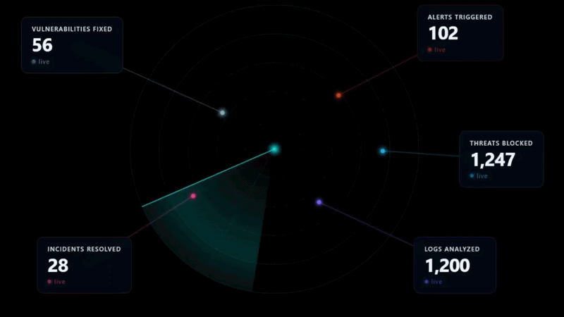

# 🛰️ Animated Radar — Live Metrics Dashboard Component



A animated radar component for React. Display live numbers — security stats, business KPIs, server health, anything — with a rotating sweep arm and glowing data blips that update in real time.

**[▶ Live Demo](https://live-metrics-radar.vercel.app/)**

---

## What This Is

A single React component you drop into any project. It shows an animated radar screen with up to 5 metric cards floating around it. Each card displays a number that counts up when the page loads. The radar arm rotates continuously. Everything glows. Colors, labels, speed, and layout are all customizable through props — no need to touch the animation code.

---

## Requirements

- React 18+
- TypeScript
- Framer Motion — `npm install framer-motion`
- Tailwind CSS — `npm install tailwindcss`

---

## Installation

**Step 1 — Copy the folder**

Paste the `LiveMetrics` folder into your project's `src` directory:

```
your-project/
└── src/
    └── LiveMetrics/     ← paste it here
```

**Step 2 — Install dependencies**

```bash
npm install framer-motion
```

**Step 3 — Import and use**

```tsx
import LiveMetrics from "./LiveMetrics"

export default function App() {
  return (
    <div style={{ background: "#020818", minHeight: "100vh" }}>
      <LiveMetrics />
    </div>
  )
}
```

> The component is designed for dark backgrounds. Any very dark color works well.

---

## Framework Compatibility

The component works with any React framework. Vite and Create React App need no extra steps. Frameworks that run code on the server (Next.js, Remix, Astro) need one small addition because the component uses browser-only APIs like `canvas` and `window`.

**Vite / Create React App**
No changes needed. Just copy the folder and import.

**Next.js**
Add `"use client"` at the top of any file that uses the component:

```tsx
"use client"
import LiveMetrics from "./LiveMetrics"
```

Or use a dynamic import with SSR disabled:

```tsx
import dynamic from "next/dynamic"

const LiveMetrics = dynamic(() => import("./LiveMetrics"), { ssr: false })
```

**Remix**
Same as Next.js — use the dynamic import approach with `ssr: false`.

**Astro**
Add the `client:only` directive:

```astro
<LiveMetrics client:only="react" />
```

---

## Customization

All customization is done through props. You never need to edit the component files.

---

### Changing Colors

Pass a `theme` prop with any combination of these values. Only include the ones you want to change — everything else stays at its default.

```tsx
<LiveMetrics
  theme={{
    accentColor: "#00E5FF",              // radar rings, sweep arm, center glow
    cardBackground: "rgba(6,18,40,0.5)", // card surface — keep semi-transparent for glass effect
    cardLabelColor: "#D9D9D9",           // small label text above the number
    cardValueColor: "#ffffff",           // the big number
    cardBorderRadius: 12,                // card corner rounding in px
    fontFamily: "inherit",               // font — defaults to whatever your app uses
    errorColor: "#D94D20",               // error banner color
  }}
/>
```

**Ready-made themes:**

Amber
```tsx
theme={{ accentColor: "#F59E0B", cardBackground: "rgba(30,20,5,0.55)", cardLabelColor: "#FDE68A", cardValueColor: "#FFFBEB" }}
```

Green
```tsx
theme={{ accentColor: "#22C55E", cardBackground: "rgba(5,20,10,0.55)", cardLabelColor: "#BBF7D0", cardValueColor: "#F0FFF4" }}
```

Purple
```tsx
theme={{ accentColor: "#A855F7", cardBackground: "rgba(15,5,30,0.55)", cardLabelColor: "#E9D5FF", cardValueColor: "#FAF5FF" }}
```

---

### Changing Radar Behavior

```tsx
<LiveMetrics
  radar={{
    ringCount: 5,       // number of concentric rings (default: 5)
    sweepSpeed: 0.012,  // rotation speed — lower is slower, 0 freezes it (default: 0.012)
    showSweep: true,    // false removes the rotating arm entirely (default: true)
  }}
/>
```

---

### Supplying Your Own Data

```tsx
import LiveMetrics from "./LiveMetrics"
import type { MetricConfig } from "./LiveMetrics"

const myMetrics: MetricConfig[] = [
  {
    id: "sales",                          // unique ID, no spaces
    label: "Sales Today",                 // card label
    value: 8420,                          // number the counter animates to
    color: "#22C55E",                     // blip and card accent color
    glowColor: "rgba(34,197,94,0.5)",     // semi-transparent version of color for glow
    position: "top-right",                // card position around the radar
    blip: {
      angle: 45,                          // position on radar in degrees (0–360)
      r: 0.65,                            // distance from center (0 = center, 1 = edge)
    },
  },
]

<LiveMetrics metrics={myMetrics} />
```

**Position slots:**

| Value | Location |
|-------|----------|
| `"top"` | Top center |
| `"top-right"` | Right side, upper |
| `"bottom-right"` | Bottom right |
| `"bottom"` | Bottom center |
| `"left"` | Left side |

---

### Layout

```tsx
<LiveMetrics
  radarSize={280}         // radar radius in px — auto-scales on small screens (default: 280)
  mobileBreakpoint={768}  // switches to stacked layout below this width in px (default: 768)
  cardMinWidth={160}      // minimum card width in px (default: 160)
/>
```

---

### Show / Hide Options

```tsx
<LiveMetrics
  hideConnectorLines={false}  // true removes the dashed lines between blips and cards
  hideLiveIndicator={false}   // true removes the pulsing "live" dot on each card
/>
```

---

### Loading State

Show skeleton placeholder cards while your data is fetching:

```tsx
<LiveMetrics isLoading={true} />
```

Set back to `false` once data arrives — cards animate in automatically.

---

### Error State

Show a banner when your data feed goes down:

```tsx
<LiveMetrics feedError="Connection lost. Reconnecting..." />
```

Set back to `null` to dismiss it.

---

### Marking a Single Metric as Disconnected

When one metric's feed fails but the others are still live:

```tsx
// mark as disconnected
setMetrics(prev =>
  prev.map(m => m.id === "sales" ? { ...m, disconnected: true } : m)
)

// mark as recovered
setMetrics(prev =>
  prev.map(m => m.id === "sales" ? { ...m, disconnected: false } : m)
)
```

The card dims to 55% opacity, the blip turns gray, and the label switches from "live" to "stale".

---

## Live Data via WebSocket

```tsx
import { useState, useEffect } from "react"
import LiveMetrics, { DEFAULT_METRICS } from "./LiveMetrics"
import type { MetricConfig } from "./LiveMetrics"

export default function Dashboard() {
  const [metrics, setMetrics]     = useState<MetricConfig[]>(DEFAULT_METRICS)
  const [isLoading, setIsLoading] = useState(true)
  const [feedError, setFeedError] = useState<string | null>(null)

  useEffect(() => {
    const ws = new WebSocket("wss://your-api/metrics")

    ws.onopen    = () => { setIsLoading(false); setFeedError(null) }
    ws.onerror   = () => setFeedError("Live feed unavailable — showing last known values.")
    ws.onclose   = () => setFeedError("Connection lost. Reconnecting…")
    ws.onmessage = (e) => {
      const { id, value } = JSON.parse(e.data)
      setMetrics(prev => prev.map(m => m.id === id ? { ...m, value } : m))
    }

    return () => ws.close()
  }, [])

  return <LiveMetrics metrics={metrics} isLoading={isLoading} feedError={feedError} />
}
```

Each time a new value arrives the card's counter re-animates to the new number automatically.

---

## All Props

| Prop | Type | Default | Description |
|------|------|---------|-------------|
| `metrics` | `MetricConfig[]` | 5 default items | Your data |
| `isLoading` | `boolean` | `false` | Shows skeleton cards |
| `feedError` | `string \| null` | `null` | Shows error banner |
| `radarSize` | `number` | `280` | Radar radius in px |
| `mobileBreakpoint` | `number` | `768` | Mobile breakpoint in px |
| `cardMinWidth` | `number` | `160` | Minimum card width in px |
| `hideConnectorLines` | `boolean` | `false` | Hides dashed connector lines |
| `hideLiveIndicator` | `boolean` | `false` | Hides the live/stale dot |
| `theme` | `Partial<LiveMetricsTheme>` | See above | Visual overrides |
| `radar` | `Partial<RadarOptions>` | See above | Radar behavior |

---

## FAQ

**Does this work with Next.js?**
Yes — add `"use client"` at the top of the file or use a dynamic import with `ssr: false`. See the Framework Compatibility section above.

**Can I use more than 5 metrics?**
The layout has 5 fixed position slots. You can use fewer than 5 but not more without modifying the layout code.

**Does it work without TypeScript?**
The files are `.tsx` so TypeScript is expected. To use in a plain JavaScript project rename the files to `.jsx` and remove the type annotations.

---

Built with React, Framer Motion, and the Canvas API.